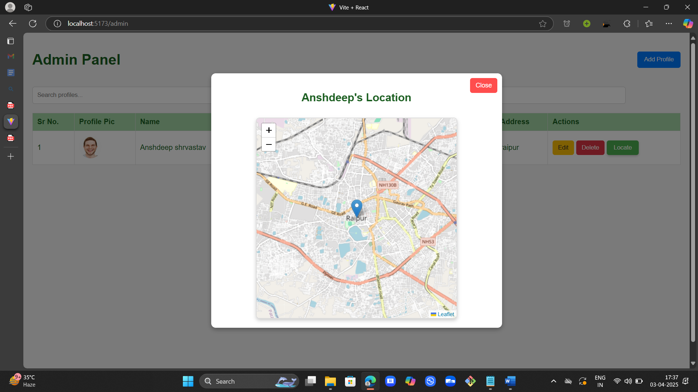
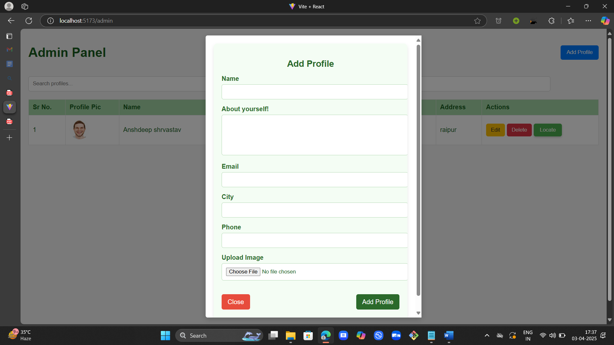
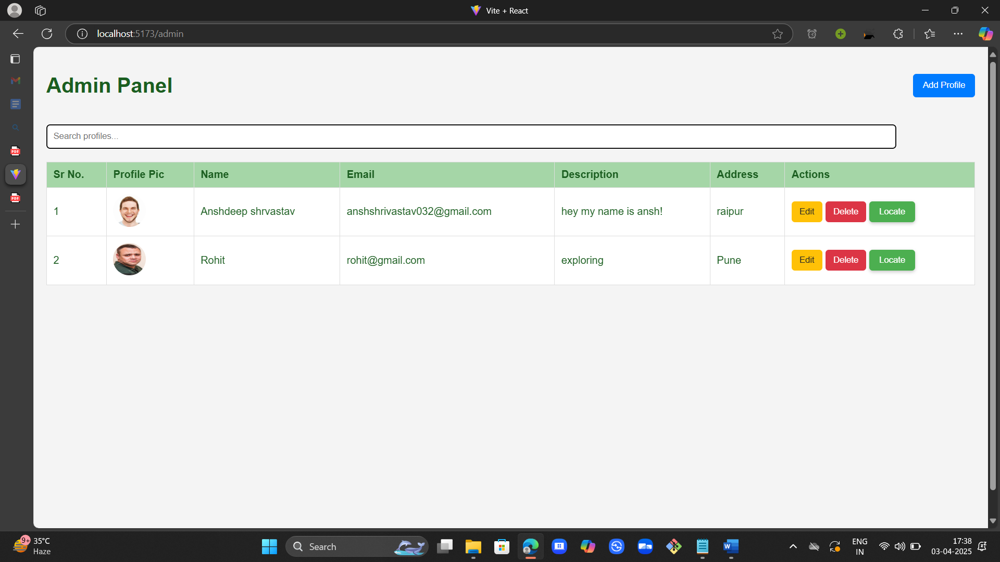
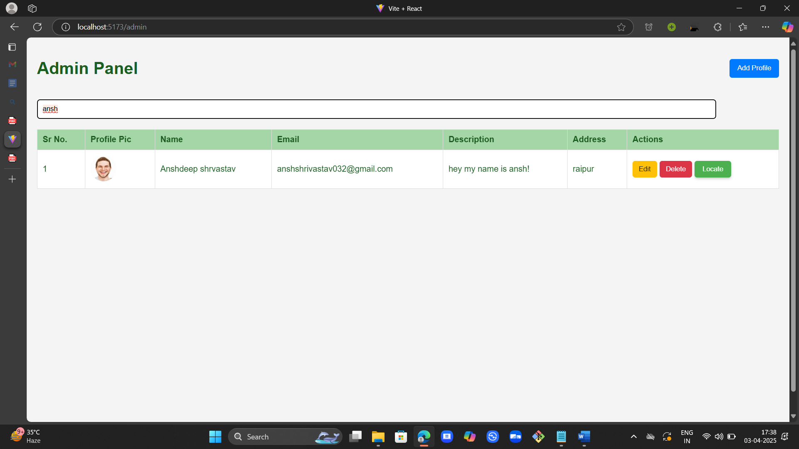
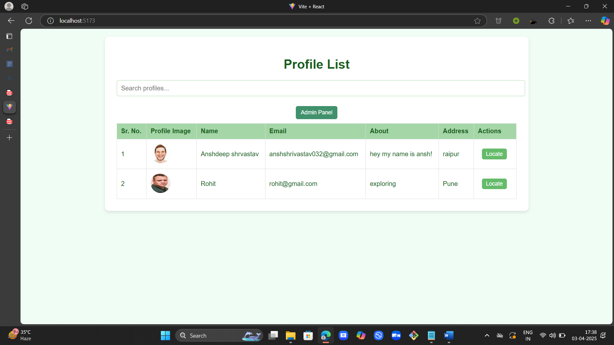

# Assignment - Frontend Case Study

## Installation

1. **Clone the repository:**
   ```bash
   git clone https://github.com/ansh-d23/Assignment_bynry.git
   ```

2. **Install React dependencies:**
   ```bash
   npm install
   ```

5. **Run the application:**
   ```bash
   npm run dev
   ```

## Images
  
  
  
  
  
